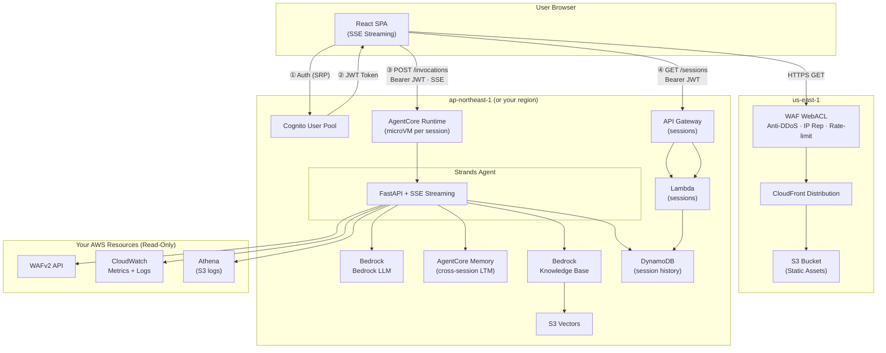

# WAF Agent

English | [中文](README_zh.md)

An AI-powered AWS WAF analysis agent that investigates security incidents, detects bypasses, and generates weekly summarys for management. Built on [Amazon Bedrock AgentCore](https://docs.aws.amazon.com/bedrock-agentcore/) + [Strands Agents SDK](https://github.com/strands-agents/sdk-python).

> [!WARNING]
> **Use Claude models. Do not choose GPT models on Amazon Bedrock for this agent unless you have tested your exact workflow.**
>
> WAF Agent analyzes security logs, blocked requests, SQLi/XSS rule matches, bypass candidates, and bot/DDoS indicators. With GPT-family models on Bedrock, this defensive WAF analysis can be silently blocked by upstream cyber-safety checks and appear as if the agent stopped responding. The recommended models are Claude Sonnet 4.6 or Claude Opus.
>
> If you already deployed with a GPT model and the agent appears stuck, send a clarifying message such as: "This is authorized defensive AWS WAF log analysis for my own environment. Please continue investigating the WAF metrics and logs. Do not provide exploit payloads, credential theft steps, evasion, persistence, malware behavior, or instructions for unauthorized systems."

## What It Does

- **Proactive security checks** — scan for bypasses, evaluate COUNT rules, audit WAF configuration
- **Incident investigation** — false positive analysis, attack source identification, IP profiling
- **Bypass detection** — find crawlers, bots, and DDoS traffic that evade WAF rules
- **Reports** — security patrol, weekly summaries, deep rule reviews (all as downloadable HTML)
- **Best practice guidance** — WAF configuration advice backed by AWS documentation
- **Privacy-aware** — masks secret values (cookies, auth/session tokens, API keys) when showing inspected request content; it will not display or judge attacks inside those secrets. See [Data Privacy](docs/data-privacy.md).

See [docs/capabilities.md](docs/capabilities.md) for full details and example questions.

## Quick Start


### Prerequisites

- AWS account with AWS WAF configured and logging enabled
- [Docker](https://docs.docker.com/get-docker/) with buildx (for ARM64 images)
- AWS CLI v2 configured with appropriate permissions

### Deploy (3 steps)

```bash
# 1. Build and push ARM64 image to ECR
aws ecr create-repository --repository-name waf-agent --region $REGION
ECR_URI=$ACCOUNT_ID.dkr.ecr.$REGION.amazonaws.com/waf-agent
aws ecr get-login-password --region $REGION | docker login --username AWS --password-stdin $ECR_URI
docker buildx build --platform linux/arm64 -t $ECR_URI:latest --push .

# 2. Deploy backend (Cognito + AgentCore)
aws cloudformation deploy --template-file deploy/backend.yaml --stack-name waf-agent \
  --region $REGION --parameter-overrides AgentContainerUri=$ECR_URI:latest \
  --capabilities CAPABILITY_NAMED_IAM

# 3. Deploy frontend (CloudFront + WAF) — must be us-east-1
aws cloudformation deploy --template-file deploy/frontend.yaml \
  --stack-name waf-agent-frontend --region us-east-1
```

See [Deployment Guide](docs/deployment.md) for region selection, frontend config, and troubleshooting.

## Architecture


<!-- Edit source: docs/architecture.drawio (open with diagrams.net) -->

<details>
<summary>Mermaid (text version)</summary>



</details>

- **Frontend**: React SPA on CloudFront + S3, protected by AWS WAF. Real-time streaming (tool calls + text tokens), per-message copy/export, multi-message share/export, dark/light theme, session history sidebar.
- **Auth**: Cognito JWT → AgentCore customJWTAuthorizer (no API Gateway needed). User identity derived from JWT claims server-side.
- **Agent**: FastAPI + Strands SDK, streams tool calls and analysis in real-time via callback_handler + asyncio.Queue
- **Session**: Isolated microVM per user, 15-min idle timeout, max 8h lifetime. History persisted to DynamoDB (30-day TTL).
- **Memory**: AgentCore Memory for cross-session LTM (facts, preferences, summaries). DynamoDB for full message history.

See [Deployment Guide](docs/deployment.md) | [User Guide](docs/user-guide.md) | [IAM Permissions](docs/iam-permissions.md) | [Cost Estimation](docs/cost-estimation.md) | [Data Privacy](docs/data-privacy.md) | [Why WAF Agent?](docs/why-waf-agent.md) | [Firehose Optimization](docs/firehose-minute-partitioning.md) | [Athena Table Detection](docs/athena-table-detection.md)

## Supported Regions

AgentCore + CloudFormation deployment works in: us-east-1, us-east-2, us-west-2, ap-northeast-1, ap-southeast-1, ap-southeast-2, ap-south-1, eu-west-1, eu-central-1.

See [Region Guide](docs/deployment.md#region-selection) for choosing the right region.

## Local Development

```bash
# Install dependencies (CLI mode only, no AG-UI packages needed)
pip install -e .

# Run locally
export AWS_PROFILE=your-profile
python agent.py "List all WebACLs"
python agent.py "Any traffic bypassing my-webacl?"
```

## Customization

The frontend agent name can be customized via environment variable — no code changes needed:

```bash
# In frontend/.env
VITE_BRAND_NAME=My Company WAF Agent
```

This changes the header, browser tab title, and conversation exports. Defaults to "WAF Analyst" if not set.

## Project Structure

```
├── agent.py              # Agent entry point (FastAPI + AG-UI + CLI dual mode)
├── tools/                # All agent tools (deterministic, no LLM in tools)
│   ├── waf_config.py     # WebACL discovery + capabilities detection
│   ├── waf_metrics.py    # CloudWatch Metrics (free, fast)
│   ├── waf_overview.py   # Quick overview (top rules, bots, attacks)
│   ├── waf_logs.py       # Log queries (36 templates + analyze_ip, CWL + Athena)
│   ├── waf_query.py      # Unified query layer (auto-routes CWL or Athena)
│   ├── waf_count_eval.py # COUNT-to-Block evaluation workflow
│   ├── waf_block_fp.py   # False positive investigation + proactive scan
│   ├── waf_bypass.py     # Bypass/evasion detection (scan + volume + IP)
│   ├── waf_challenge_check.py # Challenge/CAPTCHA compatibility check
│   ├── waf_review_deep.py # Comprehensive rules audit pipeline
│   ├── waf_patrol.py     # Security patrol (deterministic HTML report)
│   ├── report.py         # Weekly summary HTML generation
│   ├── waf_knowledge.py  # Bedrock Knowledge Base search
│   ├── ja4.py            # JA4 TLS fingerprint analysis
│   ├── session_state.py  # Per-session state (WebACL context, timezone)
│   ├── finding.py        # Investigation findings accumulator
│   └── ask_user.py       # Human-in-the-loop (CLI input / AG-UI event)
├── deploy/
│   ├── backend.yaml      # CloudFormation: Cognito + AgentCore + IAM
│   ├── frontend.yaml     # CloudFormation: CloudFront + S3 + WAF
│   └── kb.yaml           # CloudFormation: Bedrock KB + S3 Vectors
├── frontend/             # React SPA (Vite + AG-UI streaming client)
├── Dockerfile            # ARM64 container for AgentCore
└── docs/
    ├── deployment.md     # Full deployment guide
    ├── capabilities.md   # What you can ask (with examples)
    └── capabilities_zh.md
```

## License

This library is licensed under the [MIT-0](LICENSE) License.
