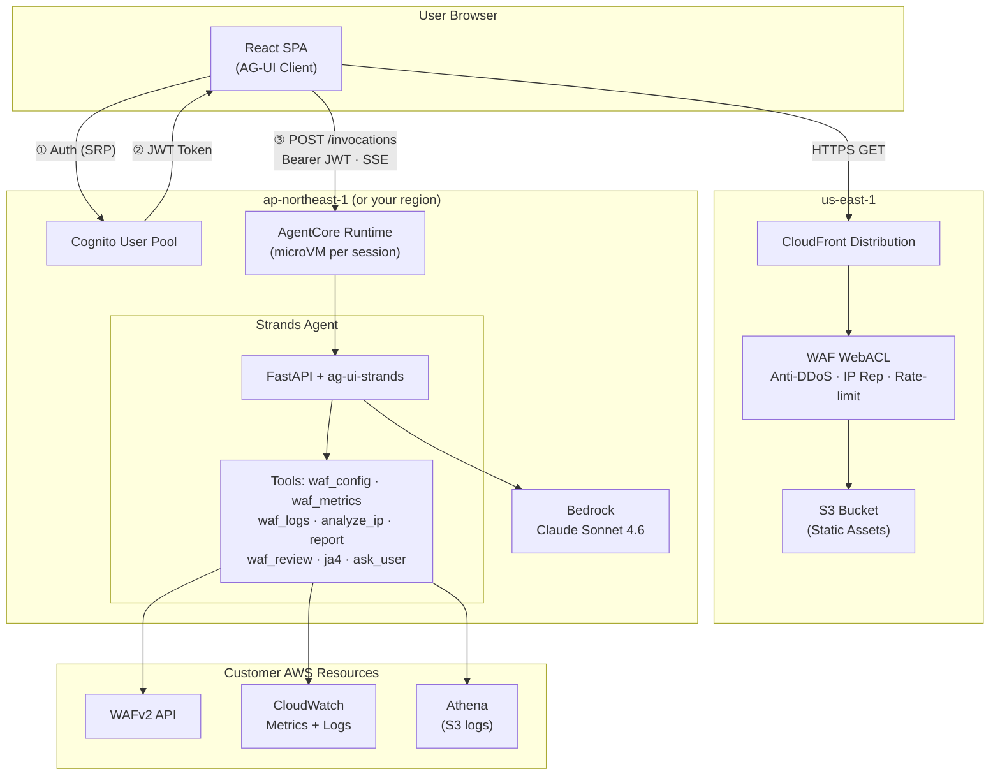

# WAF Agent

An AI-powered AWS WAF analysis agent that investigates security incidents, detects bypasses, and generates weekly business reports. Built on [Amazon Bedrock AgentCore](https://docs.aws.amazon.com/bedrock-agentcore/) + [Strands Agents SDK](https://github.com/strands-agents/sdk-python).

## What It Does

- **Investigate WAF incidents** — "What happened on May 9th?" → identifies attack sources, correlates IPs, explains WAF rule behavior
- **Detect bypasses** — finds crawlers and bots that evade WAF rules using frequency analysis
- **Generate weekly reports** — HTML business reports proving WAF ROI for management
- **Review WAF rules** — 13 deterministic checks for misconfigurations

## Quick Start

### Prerequisites

- AWS account with WAF configured and logging enabled
- [finch](https://github.com/runfinch/finch) or Docker (for building ARM64 images)
- AWS CLI v2 configured with appropriate permissions

### Deploy (3 commands)

```bash
# 1. Build and push the agent image
./deploy.sh build --region ap-northeast-1

# 2. Deploy backend (Cognito + AgentCore) — pick any supported region
./deploy.sh backend --region ap-northeast-1

# 3. Deploy frontend (CloudFront + WAF) — always us-east-1
./deploy.sh frontend
```

See [Deployment Guide](docs/deployment.md) for detailed instructions, region selection, and troubleshooting.

## Architecture


<details>
<summary>Mermaid (text version)</summary>



</details>

- **Frontend**: React SPA on CloudFront + S3, protected by WAF
- **Auth**: Cognito JWT → AgentCore customJWTAuthorizer (no API Gateway needed)
- **Agent**: FastAPI + ag-ui-strands, streams tool calls and analysis in real-time
- **Session**: Isolated microVM per user, max 8h lifetime

See [Architecture](docs/architecture.md) for the full design.

## Supported Regions

AgentCore + CloudFormation deployment works in: us-east-1, us-east-2, us-west-2, ap-northeast-1, ap-southeast-1, ap-southeast-2, ap-south-1, eu-west-1, eu-central-1.

See [Region Guide](docs/deployment.md#region-selection) for choosing the right region.

## Local Development

```bash
# Install dependencies (CLI mode only, no AG-UI packages needed)
pip install -e .

# Run locally
export AWS_PROFILE=your-profile
python agent.py "列出所有 WebACL"
python agent.py "shield-sample-webacl 有没有流量绕过了 WAF？"
```

## Project Structure

```
├── agent.py              # Agent entry point (FastAPI + AG-UI + CLI dual mode)
├── tools/                # All agent tools (deterministic, no LLM in tools)
│   ├── waf_config.py     # WebACL discovery + capabilities detection
│   ├── waf_metrics.py    # CloudWatch Metrics (free, fast)
│   ├── waf_logs.py       # CWL Insights queries (22 templates + analyze_ip)
│   ├── waf_review.py     # 13 deterministic rule checks
│   ├── report.py         # Weekly HTML report generation
│   ├── ja4.py            # JA4 TLS fingerprint lookup
│   ├── finding.py        # Investigation findings accumulator
│   └── ask_user.py       # Human-in-the-loop (CLI input / AG-UI event)
├── deploy/
│   ├── backend.yaml      # CloudFormation: Cognito + AgentCore + IAM
│   └── frontend.yaml     # CloudFormation: CloudFront + S3 + WAF
├── frontend/             # React SPA (Vite + AG-UI streaming client)
├── Dockerfile            # ARM64 container for AgentCore
└── docs/                 # Detailed documentation
```

## Documentation

- [Deployment Guide](docs/deployment.md) — step-by-step deployment with troubleshooting
- [Architecture](docs/architecture.md) — system design and data flow
- [Investigation Scenarios](docs/scenarios.md) — how the agent handles different use cases

## License

Apache-2.0
