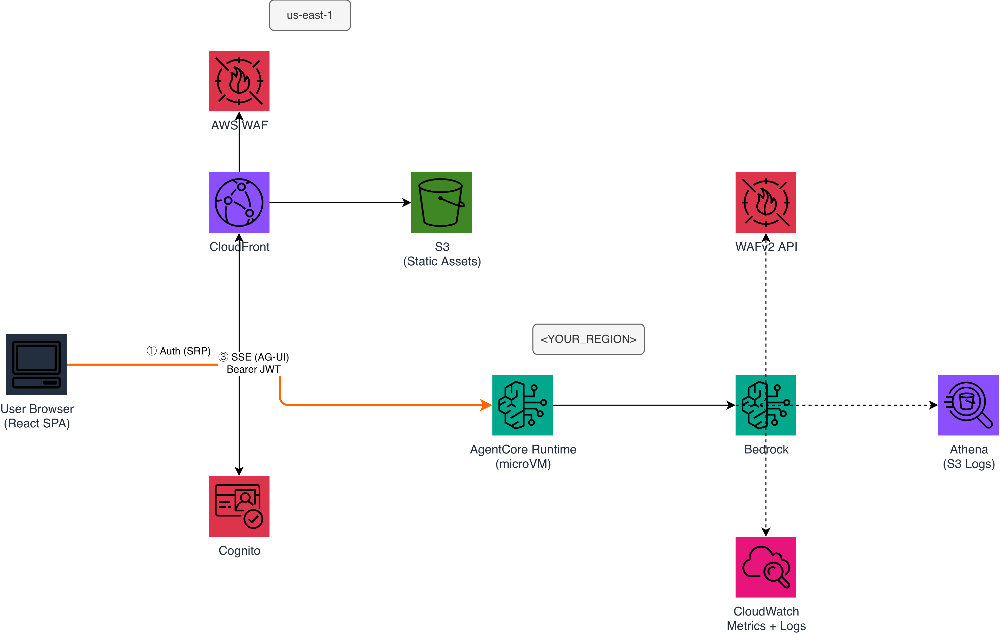
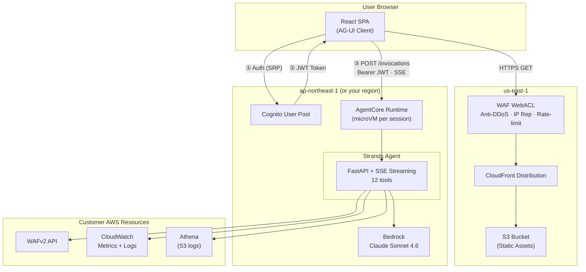

# WAF Agent

English | [中文](README_zh.md)

An AI-powered AWS WAF analysis agent that investigates security incidents, detects bypasses, and generates ROI reports for management. Built on [Amazon Bedrock AgentCore](https://docs.aws.amazon.com/bedrock-agentcore/) + [Strands Agents SDK](https://github.com/strands-agents/sdk-python).

## What It Does

- **Investigate WAF incidents** — "What happened on May 9th?" → identifies attack sources, correlates IPs, explains WAF rule behavior
- **Detect bypasses** — finds crawlers and bots that evade WAF rules using frequency analysis
- **Generate ROI reports** — HTML business reports proving WAF value for management
- **Review WAF rules** — 13 deterministic checks for misconfigurations

## Quick Start

### Prerequisites

- AWS account with WAF configured and logging enabled
- [Docker](https://docs.docker.com/get-docker/) with buildx (for ARM64 images)
- AWS CLI v2 configured with appropriate permissions

### Deploy (3 steps)

```bash
# 1. Build and push ARM64 image to ECR
aws ecr create-repository --repository-name waf-agent --region $REGION
ECR_URI=$ACCOUNT_ID.dkr.ecr.$REGION.amazonaws.com/waf-agent
aws ecr get-login-password --region $REGION | docker login --username AWS --password-stdin $ECR_URI
docker buildx build --platform linux/arm64 -t $ECR_URI:latest --push .

# 2. Deploy backend (Cognito + AgentCore)
aws cloudformation deploy --template-file deploy/backend.yaml --stack-name waf-agent \
  --region $REGION --parameter-overrides AgentContainerUri=$ECR_URI:latest \
  --capabilities CAPABILITY_NAMED_IAM

# 3. Deploy frontend (CloudFront + WAF) — must be us-east-1
aws cloudformation deploy --template-file deploy/frontend.yaml \
  --stack-name waf-agent-frontend --region us-east-1
```

See [Deployment Guide](docs/deployment.md) for region selection, frontend config, and troubleshooting.

## Architecture



<!-- Edit source: docs/architecture.drawio (open with diagrams.net) -->

<details>
<summary>Mermaid (text version)</summary>



</details>

- **Frontend**: React SPA on CloudFront + S3, protected by WAF. Real-time streaming (tool calls + text tokens), per-message copy/export, multi-message share/export, dark/light theme, sidebar guide (zh/en).
- **Auth**: Cognito JWT → AgentCore customJWTAuthorizer (no API Gateway needed)
- **Agent**: FastAPI + Strands SDK, streams tool calls and analysis in real-time via callback_handler + asyncio.Queue
- **Session**: Isolated microVM per user, 15-min idle timeout, max 8h lifetime

See [Deployment Guide](docs/deployment.md) | [User Guide](docs/user-guide.md) | [IAM Permissions](docs/iam-permissions.md) | [Cost Estimation](docs/cost-estimation.md)

## Supported Regions

AgentCore + CloudFormation deployment works in: us-east-1, us-east-2, us-west-2, ap-northeast-1, ap-southeast-1, ap-southeast-2, ap-south-1, eu-west-1, eu-central-1.

See [Region Guide](docs/deployment.md#region-selection) for choosing the right region.

## Local Development

```bash
# Install dependencies (CLI mode only, no AG-UI packages needed)
pip install -e .

# Run locally
export AWS_PROFILE=your-profile
python agent.py "List all WebACLs"
python agent.py "Any traffic bypassing my-webacl?"
```

## Project Structure

```
├── agent.py              # Agent entry point (FastAPI + AG-UI + CLI dual mode)
├── tools/                # All agent tools (deterministic, no LLM in tools)
│   ├── waf_config.py     # WebACL discovery + capabilities detection
│   ├── waf_metrics.py    # CloudWatch Metrics (free, fast)
│   ├── waf_logs.py       # CWL Insights queries (22 templates + analyze_ip)
│   ├── waf_review.py     # 13 deterministic rule checks
│   ├── report.py         # Weekly HTML report generation
│   ├── ja4.py            # JA4 TLS fingerprint lookup
│   ├── finding.py        # Investigation findings accumulator
│   └── ask_user.py       # Human-in-the-loop (CLI input / AG-UI event)
├── deploy/
│   ├── backend.yaml      # CloudFormation: Cognito + AgentCore + IAM
│   └── frontend.yaml     # CloudFormation: CloudFront + S3 + WAF
├── frontend/             # React SPA (Vite + AG-UI streaming client)
├── Dockerfile            # ARM64 container for AgentCore
└── docs/
    └── deployment.md     # Full deployment guide + troubleshooting
```

## License

MIT
