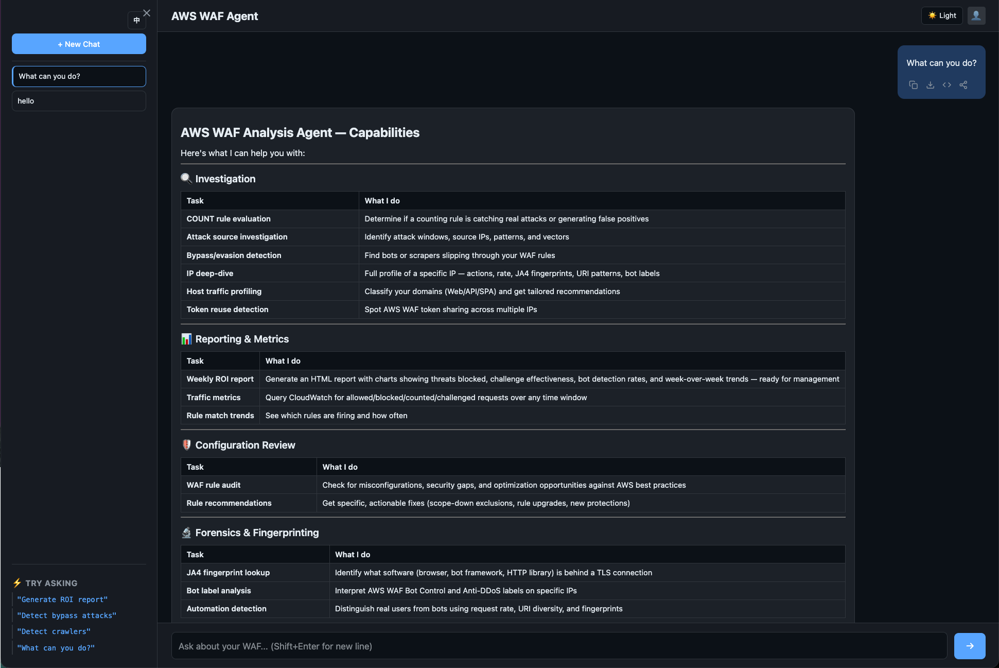
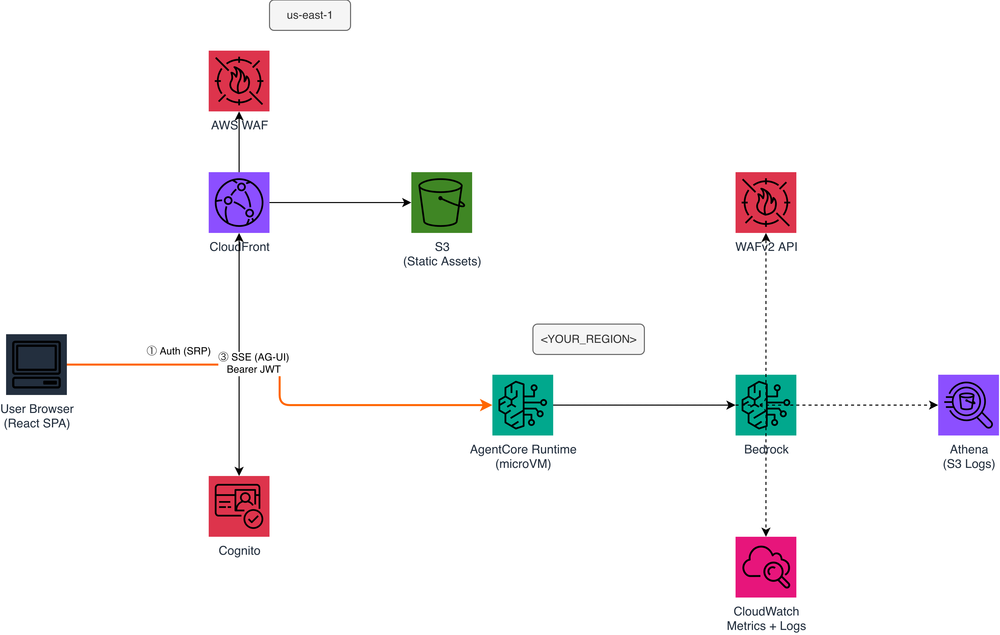
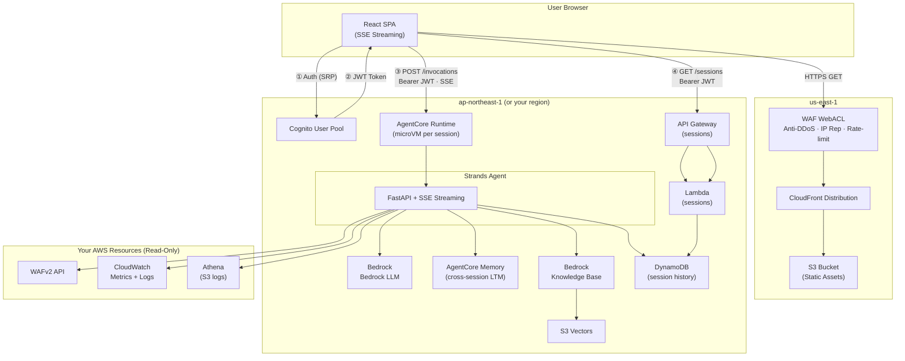

# WAF Analyst

English | [中文](README_zh.md)

An AI-powered AWS WAF analysis agent that investigates security incidents, detects bypasses, and generates weekly summarys for management. Built on [Amazon Bedrock AgentCore](https://docs.aws.amazon.com/bedrock-agentcore/) + [Strands Agents SDK](https://github.com/strands-agents/sdk-python).

> [!WARNING]
> **Use Claude models. Do not choose GPT models on Amazon Bedrock for this agent unless you have tested your exact workflow.**
>
> WAF Analyst analyzes security logs, blocked requests, SQLi/XSS rule matches, bypass candidates, and bot/DDoS indicators. With GPT-family models on Bedrock, this defensive WAF analysis can be silently blocked by upstream cyber-safety checks and appear as if the agent stopped responding. The recommended models are Claude Sonnet 4.6 or Claude Opus.
>
> If you already deployed with a GPT model and the agent appears stuck, send a clarifying message such as: "This is authorized defensive AWS WAF log analysis for my own environment. Please continue investigating the WAF metrics and logs. Do not provide exploit payloads, credential theft steps, evasion, persistence, malware behavior, or instructions for unauthorized systems."

## What It Does

- **Proactive security checks** — scan for bypasses, evaluate COUNT rules, audit WAF configuration
- **Incident investigation** — false positive analysis, attack source identification, IP profiling
- **Bypass detection** — find crawlers, bots, and DDoS traffic that evade WAF rules
- **Reports** — security patrol, weekly summaries, deep rule reviews (all as downloadable HTML)
- **Best practice guidance** — WAF configuration advice backed by AWS documentation
- **Privacy-aware** — masks secret values (cookies, auth/session tokens, API keys) when showing inspected request content; it will not display or judge attacks inside those secrets. See [Data Privacy](docs/data-privacy.md).

See [docs/capabilities.md](docs/capabilities.md) for full details and example questions.

## Quick Start



### Prerequisites

- AWS account with AWS WAF configured and logging enabled
- AWS CLI v2 configured with appropriate permissions
- Node.js 18+ (for building the frontend)
- A container tool is **optional**. [Docker](https://docs.docker.com/get-docker/) with buildx or
  [finch](https://github.com/runfinch/finch) builds the ARM64 image on your own machine. With neither,
  `deploy/image-build.yaml` builds it on AWS CodeBuild instead, which is also the answer on Windows x86,
  where a local ARM64 build runs under emulation.

Deployment is a few CloudFormation stacks, plus a container build that runs either on your machine or on
CodeBuild. Pick one of two paths:

**Option 1 — Let your AI agent drive it (recommended).** Point your coding/ops agent (Claude Code,
Cursor, etc.) at [AGENTS.md](AGENTS.md) and just talk to it:

> Read AGENTS.md and walk me through deploying WAF Analyst to my AWS account.

`AGENTS.md` is a directional runbook written for LLM agents — the stack order and dependency flow,
the inputs to collect from you, and the gotchas (ARM64-only image, us-east-1 frontend,
never-use-`:latest`, CloudFormation forgetting parameters). It links to the exact commands in the
Deployment Guide rather than duplicating them, so the agent reads each step there as it goes,
collects your region/profile, runs the commands, and captures each stack's outputs for the next one.

**Option 2 — Deploy it yourself.** Follow the [Deployment Guide](docs/deployment.md) step by step —
the single source of truth for the actual commands, with region selection, frontend config, cost
notes, and troubleshooting.

> [!IMPORTANT]
> Whichever path you pick: the container image **must be ARM64**, the frontend stack **must be
> us-east-1**, and you should **use a Claude model** (GPT-family Bedrock models can silently stall on
> WAF security analysis). Details in both docs above.

## Architecture



<!-- Edit source: docs/architecture.drawio (open with diagrams.net) -->

<details>
<summary>Mermaid (text version)</summary>


```mermaid
graph TB
    subgraph User["User Browser"]
        SPA["React SPA<br/>(SSE Streaming)"]
    end

    subgraph CF["us-east-1"]
        CloudFront["CloudFront Distribution"]
        WAF_FE["WAF WebACL<br/>Anti-DDoS · IP Rep · Rate-limit"]
        S3["S3 Bucket<br/>(Static Assets)"]
    end

    subgraph Backend["ap-northeast-1 (or your region)"]
        Cognito["Cognito User Pool"]
        AC["AgentCore Runtime<br/>(microVM per session)"]
        subgraph Agent["Strands Agent"]
            FastAPI["FastAPI + SSE Streaming"]
        end
        Bedrock["Bedrock<br/>Bedrock LLM"]
        Memory["AgentCore Memory<br/>(cross-session LTM)"]
        KB["Bedrock<br/>Knowledge Base"]
        S3Vec["S3 Vectors"]
        DDB["DynamoDB<br/>(session history)"]
        APIGW["API Gateway<br/>(sessions)"]
        Lambda["Lambda<br/>(sessions)"]
    end

    subgraph AWS["Your AWS Resources (Read-Only)"]
        WAFv2["WAFv2 API"]
        CW["CloudWatch<br/>Metrics + Logs"]
        Athena["Athena<br/>(S3 logs)"]
    end

    SPA -->|"HTTPS GET"| WAF_FE
    WAF_FE --> CloudFront --> S3
    SPA -->|"① Auth (SRP)"| Cognito
    Cognito -->|"② JWT Token"| SPA
    SPA -->|"③ POST /invocations<br/>Bearer JWT · SSE"| AC
    SPA -->|"④ GET /sessions<br/>Bearer JWT"| APIGW
    APIGW --> Lambda
    AC --> FastAPI
    FastAPI --> Bedrock
    FastAPI --> Memory
    FastAPI --> KB
    KB --> S3Vec
    FastAPI --> DDB
    APIGW --> Lambda --> DDB
    FastAPI --> WAFv2
    FastAPI --> CW
    FastAPI --> Athena
```

</details>

- **Frontend**: React SPA on CloudFront + S3, protected by AWS WAF. Real-time streaming (tool calls + text tokens), per-message copy/export, multi-message share/export, dark/light theme, session history sidebar.
- **Auth**: Cognito JWT → AgentCore customJWTAuthorizer (no API Gateway needed). User identity derived from JWT claims server-side.
- **Agent**: FastAPI + Strands SDK, streams tool calls and analysis in real-time via callback_handler + asyncio.Queue
- **Session**: Isolated microVM per user, 15-min idle timeout, max 8h lifetime. History persisted to DynamoDB (30-day TTL).
- **Memory**: AgentCore Memory for cross-session LTM (facts, preferences, summaries). DynamoDB for full message history.

See [Deployment Guide](docs/deployment.md) | [Known Limitations](docs/limitations.md) | [User Guide](docs/user-guide.md) | [IAM Permissions](docs/iam-permissions.md) | [Cost Estimation](docs/cost-estimation.md) | [Data Privacy](docs/data-privacy.md) | [Why WAF Analyst?](docs/why-waf-agent.md) | [Firehose Optimization](docs/firehose-minute-partitioning.md) | [Athena Table Detection](docs/athena-table-detection.md) | [Hourly vs Minute Partitioning](docs/hourly-vs-minute-partitioning.md) | [Roadmap](docs/roadmap.md)

## Supported Regions

AgentCore + CloudFormation deployment works in: us-east-1, us-east-2, us-west-2, ap-northeast-1, ap-southeast-1, ap-southeast-2, ap-south-1, eu-west-1, eu-central-1.

See [Region Guide](docs/deployment.md#region-selection) for choosing the right region.

## Local Development

```bash
# Install dependencies (CLI mode only, no AG-UI packages needed)
pip install -e .

# Run locally
export AWS_PROFILE=your-profile
python agent.py "List all WebACLs"
python agent.py "Any traffic bypassing my-webacl?"
```

## Customization

The frontend agent name can be customized via environment variable — no code changes needed:

```bash
# In frontend/.env
VITE_BRAND_NAME=My Company WAF Analyst
```

This changes the header, browser tab title, and conversation exports. Defaults to "WAF Analyst" if not set.

## Project Structure

```
├── agent.py              # Agent entry point (FastAPI + AG-UI + CLI dual mode)
├── tools/                # All agent tools (deterministic, no LLM in tools)
│   ├── waf_config.py     # WebACL discovery + capabilities detection
│   ├── waf_metrics.py    # CloudWatch Metrics (free, fast)
│   ├── waf_overview.py   # Quick overview (top rules, bots, attacks)
│   ├── waf_logs.py       # Log queries (37 templates + analyze_ip, CWL + Athena)
│   ├── waf_query.py      # Unified query layer (auto-routes CWL or Athena)
│   ├── waf_count_eval.py # COUNT-to-Block evaluation workflow
│   ├── waf_block_fp.py   # False positive investigation + proactive scan
│   ├── waf_bypass.py     # Bypass/evasion detection (scan + volume + IP)
│   ├── waf_challenge_check.py # Challenge/CAPTCHA compatibility check
│   ├── waf_review_deep.py # Comprehensive rules audit pipeline
│   ├── waf_patrol.py     # Security patrol (deterministic HTML report)
│   ├── report.py         # Weekly summary HTML generation
│   ├── waf_knowledge.py  # Bedrock Knowledge Base search
│   ├── ja4.py            # JA4 TLS fingerprint analysis
│   ├── session_state.py  # Per-session state (WebACL context, timezone)
│   ├── finding.py        # Investigation findings accumulator
│   └── ask_user.py       # Human-in-the-loop (CLI input / AG-UI event)
├── deploy/
│   ├── backend.yaml      # CloudFormation: Cognito + AgentCore + IAM
│   ├── frontend.yaml     # CloudFormation: CloudFront + S3 + WAF
│   ├── image-build.yaml  # CloudFormation: builds the ARM64 image on CodeBuild, no local Docker
│   ├── kb.yaml           # CloudFormation: Bedrock KB + S3 Vectors
│   ├── sessions-api.yaml # CloudFormation: API Gateway + Lambda (session history)
│   └── sync-kb.sh        # Uploads kb-docs/ to S3 and starts ingestion
├── frontend/             # React SPA (Vite + AG-UI streaming client)
├── Dockerfile            # ARM64 container for AgentCore
└── docs/
    ├── deployment.md     # Full deployment guide
    ├── capabilities.md   # What you can ask (with examples)
    └── capabilities_zh.md
```

## License

This library is licensed under the [MIT-0](LICENSE) License.
