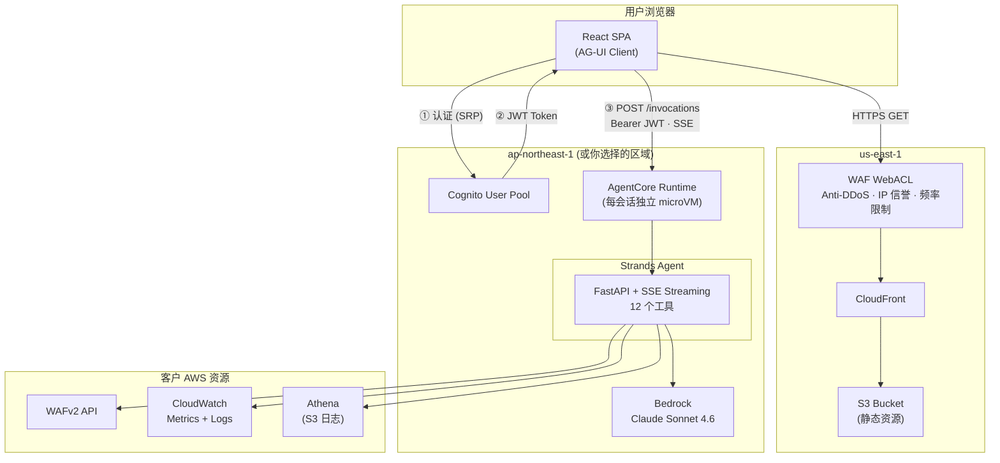

# WAF Agent

[English](README.md) | 中文

基于 [Amazon Bedrock AgentCore](https://docs.aws.amazon.com/bedrock-agentcore/) + [Strands Agents SDK](https://github.com/strands-agents/sdk-python) 构建的智能 WAF 分析工具，能自动调查安全事件、检测绕过攻击、生成周度业务报告。

## 功能

- **调查 WAF 事件** — "5月9号发生了什么？" → 定位攻击源、关联 IP、解释规则行为
- **检测绕过攻击** — 通过频率分析发现绕过 WAF 规则的爬虫和自动化工具
- **生成价值报告** — 面向管理层的 HTML 报告，证明 WAF 投入的 ROI
- **审查 WAF 规则** — 13 项确定性检查，发现配置问题

## 快速开始

### 前置条件

- 已配置 WAF 并开启日志的 AWS 账号
- [Docker](https://docs.docker.com/get-docker/)（需要 buildx，用于构建 ARM64 镜像）
- AWS CLI v2

### 部署（3 步）

```bash
# 1. 构建并推送 ARM64 镜像到 ECR
aws ecr create-repository --repository-name waf-agent --region $REGION
ECR_URI=$ACCOUNT_ID.dkr.ecr.$REGION.amazonaws.com/waf-agent
aws ecr get-login-password --region $REGION | docker login --username AWS --password-stdin $ECR_URI
docker buildx build --platform linux/arm64 -t $ECR_URI:latest --push .

# 2. 部署后端（Cognito + AgentCore）
aws cloudformation deploy --template-file deploy/backend.yaml --stack-name waf-agent \
  --region $REGION --parameter-overrides AgentContainerUri=$ECR_URI:latest \
  --capabilities CAPABILITY_NAMED_IAM

# 3. 部署前端（CloudFront + WAF）— 必须在 us-east-1
aws cloudformation deploy --template-file deploy/frontend.yaml \
  --stack-name waf-agent-frontend --region us-east-1
```

详细步骤见[部署指南](docs/deployment_zh.md)。

## 架构


<!-- 编辑源文件: docs/architecture.drawio (用 diagrams.net 打开) -->

<details>
<summary>Mermaid 文本版</summary>



</details>

- **前端**：React SPA 部署在 CloudFront + S3，受 WAF 保护。实时流式（工具调用 + 文本 token），消息复制/导出，多消息分享导出，明暗主题，侧边栏指南（中/英）。
- **认证**：Cognito JWT → AgentCore customJWTAuthorizer（不需要 API Gateway）
- **Agent**：FastAPI + Strands SDK，通过 callback_handler + asyncio.Queue 实时流式推送工具调用和分析过程
- **会话**：每用户独立 microVM，空闲 15 分钟超时，最长 8 小时

详见 [部署指南](docs/deployment_zh.md) | [使用指南](docs/user-guide_zh.md) | [IAM 权限说明](docs/iam-permissions_zh.md) | [成本估算](docs/cost-estimation_zh.md)

## 支持的区域

AgentCore + CloudFormation 部署支持：us-east-1, us-east-2, us-west-2, ap-northeast-1, ap-southeast-1, ap-southeast-2, ap-south-1, eu-west-1, eu-central-1。

详见[部署指南 - 区域选择](docs/deployment_zh.md#区域选择)。

## 本地开发

```bash
# 安装依赖（CLI 模式，不需要 AG-UI 包）
pip install -e .

# 本地运行
export AWS_PROFILE=your-profile
python agent.py "列出所有 WebACL"
python agent.py "shield-sample-webacl 有没有流量绕过了 WAF？"
```

## 项目结构

```
├── agent.py              # Agent 入口（FastAPI + AG-UI + CLI 双模式）
├── tools/                # 所有工具（确定性逻辑，工具内部不调用 LLM）
│   ├── waf_config.py     # WebACL 发现 + 能力检测
│   ├── waf_metrics.py    # CloudWatch Metrics（免费、快速）
│   ├── waf_logs.py       # CWL Insights 查询（22 个模板 + analyze_ip）
│   ├── waf_athena.py     # Athena 查询（S3 日志，自动建表）
│   ├── waf_review.py     # 13 项确定性规则检查
│   ├── report.py         # ROI 报告 HTML 生成
│   ├── ja4.py            # JA4 TLS 指纹查询
│   ├── finding.py        # 调查发现累积器
│   └── ask_user.py       # 人机交互（CLI 输入 / AG-UI 事件）
├── deploy/
│   ├── backend.yaml      # CloudFormation: Cognito + AgentCore + IAM
│   └── frontend.yaml     # CloudFormation: CloudFront + S3 + WAF
├── frontend/             # React SPA（Vite + AG-UI 流式客户端）
├── Dockerfile            # ARM64 容器
└── docs/
    └── deployment.md     # 完整部署指南 + 故障排查
```

## License

MIT
