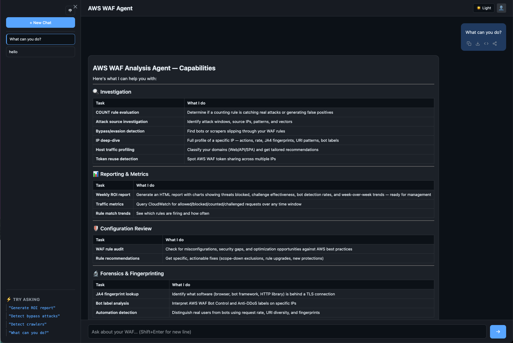
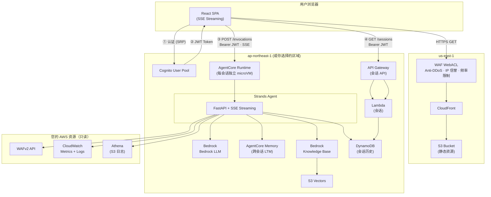

# WAF Agent

[English](README.md) | 中文

基于 [Amazon Bedrock AgentCore](https://docs.aws.amazon.com/bedrock-agentcore/) + [Strands Agents SDK](https://github.com/strands-agents/sdk-python) 构建的智能 AWS WAF 分析工具，能自动调查安全事件、检测绕过攻击、生成周度业务报告。

> [!WARNING]
> **请使用 Claude 模型。除非你已经完整测试过自己的工作流，否则强烈不建议在 Amazon Bedrock 上为本 Agent 选择 GPT 模型。**
>
> WAF Agent 会分析安全日志、拦截请求、SQLi/XSS 规则命中、绕过候选、Bot/DDoS 指标。使用 Bedrock 上的 GPT 系列模型时，这类防御性的 WAF 分析很容易被上游 cyber-safety 检查静默拦截，表现为 Agent 突然没有反应，用户界面里也可能看不到明确错误。推荐使用 Claude Sonnet 4.6 或 Claude Opus。
>
> 如果你已经部署了 GPT 模型，并发现 Agent 没有反应，请发送类似这句话恢复上下文："我只是在防御性地分析自己环境中的 AWS WAF 日志和指标。请继续调查 WAF metrics 和 logs。不要提供 exploit payload、凭证窃取步骤、规避、持久化、恶意软件行为，或任何针对未授权系统的操作说明。"

## 功能

- **主动安全检查** — 扫描漏杀、评估 COUNT 规则、审计 WAF 配置
- **事件调查** — 误杀分析、攻击源定位、IP 行为画像
- **漏杀检测** — 发现绕过 WAF 的爬虫、Bot 和 DDoS 流量
- **报告** — 安全巡检、周报摘要、深度规则审查（均为可下载 HTML）
- **最佳实践指导** — 基于 AWS 文档的 WAF 配置建议

详见 [docs/capabilities.md](docs/capabilities.md)（英文）和 [docs/capabilities_zh.md](docs/capabilities_zh.md)。

## 快速开始



### 前置条件

- 已配置 AWS WAF 并开启日志的 AWS 账号
- [Docker](https://docs.docker.com/get-docker/)（需要 buildx，用于构建 ARM64 镜像）
- AWS CLI v2

### 部署（3 步）

```bash
# 1. 构建并推送 ARM64 镜像到 ECR
aws ecr create-repository --repository-name waf-agent --region $REGION
ECR_URI=$ACCOUNT_ID.dkr.ecr.$REGION.amazonaws.com/waf-agent
aws ecr get-login-password --region $REGION | docker login --username AWS --password-stdin $ECR_URI
docker buildx build --platform linux/arm64 -t $ECR_URI:latest --push .

# 2. 部署后端（Cognito + AgentCore）
aws cloudformation deploy --template-file deploy/backend.yaml --stack-name waf-agent \
  --region $REGION --parameter-overrides AgentContainerUri=$ECR_URI:latest \
  --capabilities CAPABILITY_NAMED_IAM

# 3. 部署前端（CloudFront + WAF）— 必须在 us-east-1
aws cloudformation deploy --template-file deploy/frontend.yaml \
  --stack-name waf-agent-frontend --region us-east-1
```

详细步骤见[部署指南](docs/deployment_zh.md)。

## 架构


<!-- 编辑源文件: docs/architecture.drawio (用 diagrams.net 打开) -->

<details>
<summary>Mermaid 文本版</summary>



</details>

- **前端**：React SPA 部署在 CloudFront + S3，受 AWS WAF 保护。实时流式（工具调用 + 文本 token），消息复制/导出，多消息分享导出，明暗主题，会话历史侧边栏。
- **认证**：Cognito JWT → AgentCore customJWTAuthorizer（不需要 API Gateway）。用户身份从 JWT claims 服务端提取。
- **Agent**：FastAPI + Strands SDK，通过 callback_handler + asyncio.Queue 实时流式推送工具调用和分析过程
- **会话**：每用户独立 microVM，空闲 15 分钟超时，最长 8 小时。历史持久化到 DynamoDB（30 天 TTL）。
- **记忆**：AgentCore Memory 提供跨会话 LTM（事实、偏好、摘要）。DynamoDB 存储完整消息历史。

详见 [部署指南](docs/deployment_zh.md) | [使用指南](docs/user-guide_zh.md) | [IAM 权限说明](docs/iam-permissions_zh.md) | [成本估算](docs/cost-estimation_zh.md) | [数据隐私](docs/data-privacy_zh.md) | [为什么需要 WAF Agent？](docs/why-waf-agent_zh.md)

## 支持的区域

AgentCore + CloudFormation 部署支持：us-east-1, us-east-2, us-west-2, ap-northeast-1, ap-southeast-1, ap-southeast-2, ap-south-1, eu-west-1, eu-central-1。

详见[部署指南 - 区域选择](docs/deployment_zh.md#区域选择)。

## 本地开发

```bash
# 安装依赖（CLI 模式，不需要 AG-UI 包）
pip install -e .

# 本地运行
export AWS_PROFILE=your-profile
python agent.py "列出所有 WebACL"
python agent.py "my-webacl 有没有流量绕过了 WAF？"
```

## 自定义

前端显示的 Agent 名称可通过环境变量自定义，无需改代码：

```bash
# 在 frontend/.env 中
VITE_BRAND_NAME=我的公司 WAF Agent
```

会影响页面标题、浏览器标签页和对话导出。未设置时默认为 "AWS WAF Agent"。

## 项目结构

```
├── agent.py              # Agent 入口（FastAPI + AG-UI + CLI 双模式）
├── tools/                # 所有工具（确定性逻辑，工具内部不调用 LLM）
│   ├── waf_config.py     # WebACL 发现 + 能力检测
│   ├── waf_metrics.py    # CloudWatch Metrics（免费、快速）
│   ├── waf_overview.py   # 快速概览（Top 规则、Bot、攻击类型）
│   ├── waf_logs.py       # 日志查询（20 个模板 + analyze_ip，CWL + Athena）
│   ├── waf_query.py      # 统一查询层（自动路由 CWL 或 Athena）
│   ├── waf_count_eval.py # COUNT 转 Block 评估工作流
│   ├── waf_block_fp.py   # 误杀排查 + 主动扫描
│   ├── waf_bypass.py     # 漏杀检测（扫描 + 流量异常 + IP 分析）
│   ├── waf_challenge_check.py # Challenge/CAPTCHA 兼容性检查
│   ├── waf_review_deep.py # 全面规则审计管线
│   ├── waf_patrol.py     # 安全巡检（确定性 HTML 报告）
│   ├── report.py         # 周报摘要 HTML 生成
│   ├── waf_knowledge.py  # Bedrock Knowledge Base 搜索
│   ├── ja4.py            # JA4 TLS 指纹查询
│   ├── session_state.py  # 会话状态（WebACL 上下文、时区）
│   ├── finding.py        # 调查发现累积器
│   └── ask_user.py       # 人机交互（CLI 输入 / AG-UI 事件）
├── deploy/
│   ├── backend.yaml      # CloudFormation: Cognito + AgentCore + IAM
│   ├── frontend.yaml     # CloudFormation: CloudFront + S3 + WAF
│   └── kb.yaml           # CloudFormation: Bedrock KB + S3 Vectors
├── frontend/             # React SPA（Vite + AG-UI 流式客户端）
├── Dockerfile            # ARM64 容器
└── docs/
    ├── deployment.md     # 完整部署指南
    ├── capabilities.md   # 功能说明（英文，含示例）
    └── capabilities_zh.md # 功能说明（中文）
```

## License

This library is licensed under the [MIT-0](LICENSE) License.
